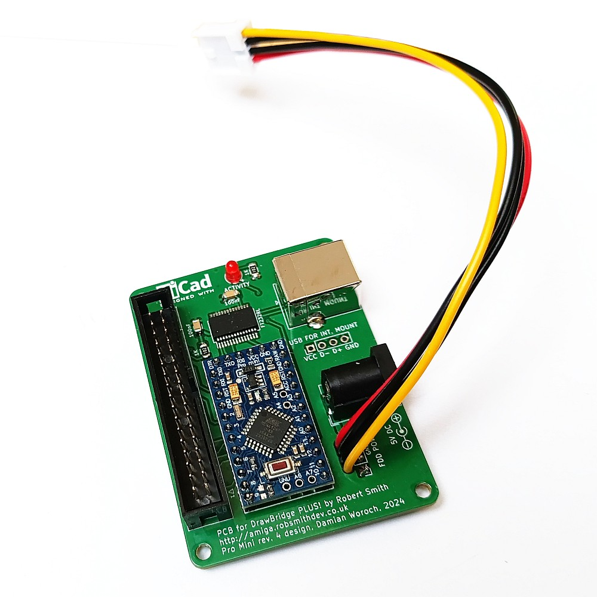
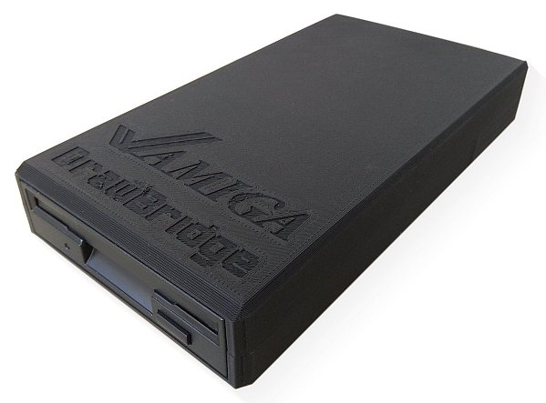

# KicadDrawBridgePlus
PCB design I've made for the DrawBridge Plus! project by Robert Smith. Based on DrawBridge Plus! schematic.
Visit author's page for more information about the project: http://amiga.robsmithdev.co.uk/

3D case: https://www.thingiverse.com/thing:5342990

## Changelog

Rev. 4:
* remove +12V socket, 95% of drives are powered with +5V only
* added pin header for mounting DrawBridge in a PC case (internal USB)

Rev. 3:  
* added floppy power cable relief  
* changed resistors size from 0805 to 1206 for easier assembly  

## FT232 note  
Watch out for fake FT232 chips, buy them only from good known source. With fake chips, a read transfer test will fail, also making disk->SCP read unstable.
